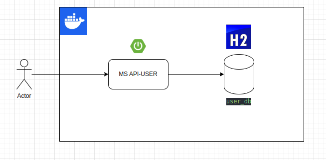

# Microservicio API-USER

Este microservicio tiene la finalidad de poder registrar un usuario, consultar datos de un usuario, listar todos los usuarios y realizar un login con datos de usuario.


## Environment Variables

Para configurar el proyecto, primero se deben ingresar los siguientes datos en el archivo application.properties

`spring.datasource.username=sa`

`spring.datasource.password=password`


## Ejecutar en local con Docker

**IMPORTANTE**: en caso que no poseamos Docker en nuestra laptop, podemos levantar el proyecto con nuestro IDE de preferencia y realizar los ajustes pertinentes en el run configuration para que levante el proyecto con Java 8+ y teniendo en cuenta las variables antes mencionadas.

Continuando, para ejecutar el proyecto, debemos tener instalado **Docker** para poder generar la imágen de la app y levantar el proyecto.

Antes de todo, con el builder de Maven vamos a generar el archivo jar

```bash
  mvn package
```

Ingresamos al directorio raiz del proyecto

```bash
  cd api-usuario
```

Generamos la imagen para nuestro proyecto

```bash
  docker build -t spring-boot-docker .
```

Verificamos que haya generado correctamente la imágen con el nombre "spring-boot-docker"

```bash
  docker images
```

Para ejecutar el contenedor Docker ejecutamos lo siguiente

```bash
  docker run --name MiContenedorAppUser --publish 8080:8080 spring-boot-docker
```

Una vez levantado el contenedor, vamos a poder probar los diferentes endpoints vamos a poder hacerlo con la collection de postman que se encuentra en el directorio collection-postman

```bash
  api-usuario/collection-postman
```

## Acceso a H2

Para poder visualizar de manera gráfica los datos que persiste el microservicio, podemos acceder a la base de datos mediante la consola de H2. 

Para ello, lo que necesitamos la url de la consola

```bash
url consola H2: http://localhost:8080/h2-console
```

Y los datos de conexión como url de la base de datos, usuario y contraseña

```bash
  url=jdbc:h2:mem:user_db
  username=sa
  password=password
```
## Diagrama Arquitectura



